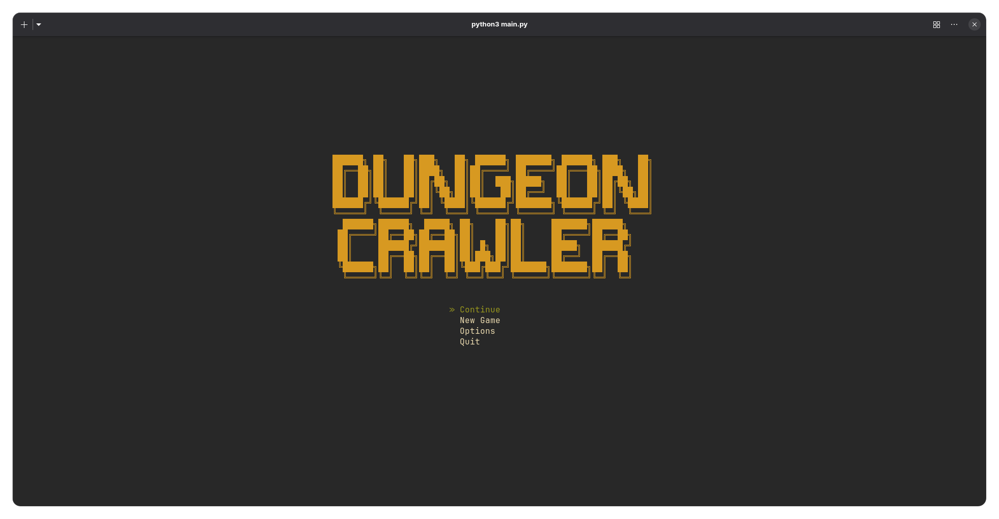

# Dungeon Crawler (TUI Game)



Sebuah game *RPG Dungeon Crawler* klasik berbasis terminal (TUI) yang ditulis dalam Python menggunakan library `curses`. Masuki dungeon, hadapi monster, kumpulkan *loot*, rekrut hero di *tavern* (kedai minum), dan perkuat tim Anda untuk mencapai lantai tertinggi.

## Fitur Utama

- **Sistem Pertarungan Turn-based (Real-time Gauge):** Kecepatan hero menentukan giliran bertindak.
- **Manajemen Tim & Party:** Rekrut berbagai class hero, susun formasi active party maksimal 4 orang, dan simpan sisanya sebagai cadangan.
- **Gudang Senjata & Inventory:** Equip gear hero dengan berbagai senjata, armor, dan aksesoris yang didapat dari battle.
- **Shop & Economy:** Jual item yang tidak dibutuhkan di toko dan rekrut hero baru menggunakan gold.
- **Sistem Save/Load Game:** Tiga slot save data yang menyimpan *progress* lantai dungeon, gold, inventory, dan status hero beserta equipment-nya.
- **Mode Auto-Battle:** Fitur bertarung otomatis dengan AI cerdas (prioritas heal hero sekarat, finishing move, pemilihan target optimal).

## Struktur Class Karakter (Archetypes)

Pilih dan kombinasikan 4 hero aktif dari berbagai class:
- **Warrior** - Petarung garis depan seimbang.
- **Mage** - Pengguna sihir dengan damage luar biasa namun HP rendah.
- **Priest** - Penyembuh vital bagi tim.
- **Rogue** - Karakter lincah dengan kecepatan tinggi.
- **Paladin** - Ksatria suci dengan pertahanan baja dan HP tertinggi.
- ... dan banyak lagi (Sorcerer, Berserker, Monk, Samurai, Ranger, Druid, Necromancer, Bard, Alchemist, Assassin).

---

## System Requirements

Game ini menggunakan built-in library Python `curses`.
- **Sistem Operasi:** Linux, macOS, atau Windows.
- **Python:** Python 3.8 atau versi di atasnya.
- **Terminal:** Minimum tinggi terminal adalah 15 baris (disarankan lebih besar untuk kenyamanan visual terbaik).

---

## Panduan Instalasi & Menjalankan Game

### 1. Clone Repository
```bash
git clone https://github.com/USERNAME/dungeon-crawler.git
cd dungeon_crawler
```

### 2. Install Dependencies (Khusus Windows)
Jika Anda menggunakan **Windows**, `curses` tidak disertakan secara default di Python untuk Windows. Anda harus menginstal library `windows-curses` terlebih dahulu:
```bash
pip install windows-curses
```
Untuk pengguna **Linux** dan **macOS**, tidak memerlukan instalasi tambahan apa pun karena `curses` merupakan built-in library OS.

### 3. Menjalankan Game
Jalankan game melalui terminal dengan perintah:
```bash
python main.py
```

---

## Kontrol Permainan

- **Navigasi Menu / Target:** Gunakan tombol **Panah ATAS / BAWAH** (atau mouse click jika didukung terminal).
- **Konfirmasi / Memilih:** Tekan **ENTER** atau **Tombol Spasi**.
- **Kembali / Membatalkan:** Tekan tombol **ESC** atau **Q**.
- **Dalam Pertarungan (Combat):**
  - **A** - Mengaktifkan / menonaktifkan mode **Auto-Battle** di tengah pertarungan.
